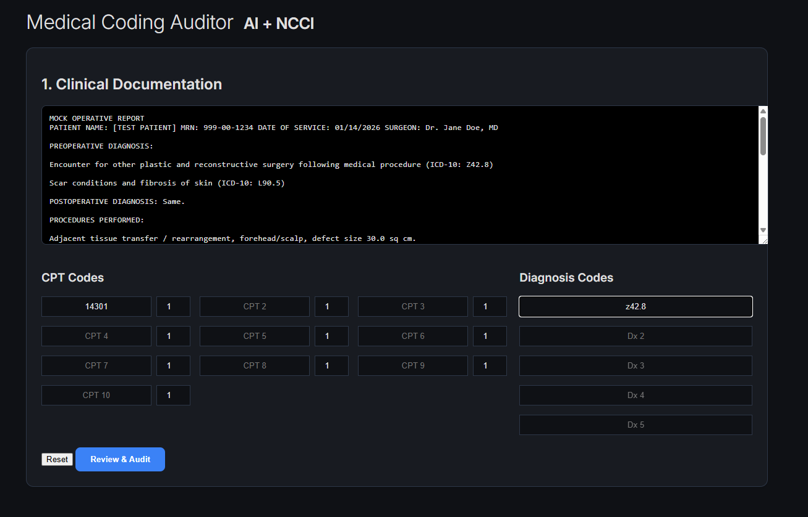
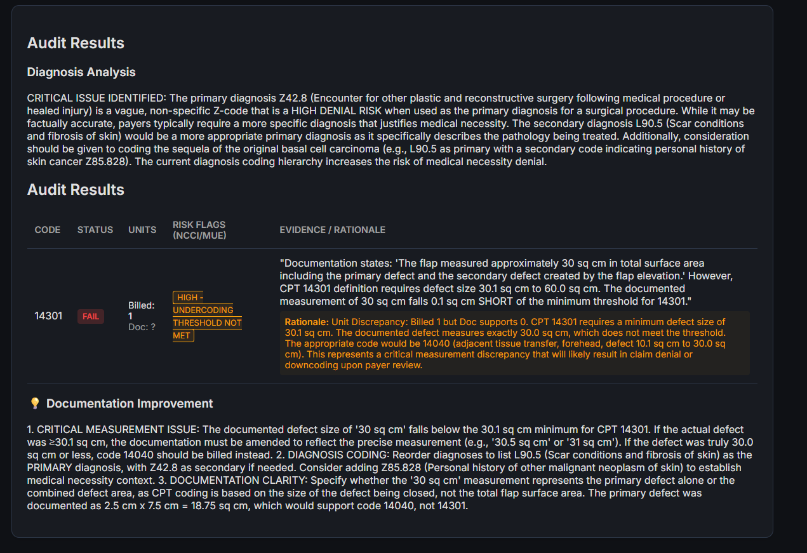

# medical-compliance-engine

A comprehensive, AI-powered medical coding audit system designed to verify CPT codes against clinical documentation, enforce NCCI/MUE billing rules, and ensure compliance.

## 🚀 Key Features

*   **AI-Powered Verification**: Uses **Anthropic Claude 4.5 Sonnet** (via direct API or **AWS Bedrock**) to analyze sanitized clinical text and verify if documentation supports billed CPT codes.
*   **Regulatory Compliance Engine**:
    *   **NCCI Checks**: Deterministic checks for National Correct Coding Initiative (NCCI) bundling edits (PTP).
    *   **MUE Checks**: Enforces Medically Unlikely Edits (MUE) limits based on user-provided units.
    *   **Hybrid Lookup**: Prioritizes custom "Augmented Rules" for specific payer requirements, falling back to an official CPT database (ingested from RVU files) for standard definitions.
*   **Privacy First**:
    *   **Local PHI Redaction**: Microsoft Presidio runs LOCALLY to redact Patient Names, MRNs, Dates, and other identifiers *before* data leaves your machine.
    *   **Redaction Viewer**: Review and approve sanitized text in the UI before submission.
    *   **HIPAA Compliance**: For production use with PHI, ensure you are using an Enterprise LLM API with a signed Business Associate Agreement (BAA).
*   **Interactive Web UI**: Clean, dark-mode Flask application for easy data entry (Calculated vs. Billed Units display).
    *   **NEW: Interactive Chat**: Ask follow-up questions to the "Auditor Agent" about specific denials or coding advice.
    *   **Rich Formatting**: Results and advice are formatted for readability (bolding, lists, etc.).
*   **Production Ready**: Includes `Dockerfile` for easy deployment, comprehensive logging, and automated test suite.



## 🛠️ Architecture

The project follows a **3-Layer Architecture** (Directive, Orchestration, Execution):

*   **`app.py`** (Orchestration): The Flask web server acting as the entry point and controller.
*   **`execution/`** (Execution): Deterministic Python scripts handling the logic.
    *   `medical_audit.py`: Main audit logic, LLM integration, and rule merging.
    *   `sanitize_phi.py`: Presidio configuration for PHI redaction.
    *   `ingest_coding_rules.py`: ETL script to populate the SQLite database.
    *   `cpt_data.py`: Custom/Augmented CPT rule definitions.
*   **`coding_rules.db`**: SQLite database storing NCCI edits, MUE limits, and Official CPT descriptions.


## 📦 Setup & Installation

1.  **Prerequisites**: Python 3.12+, SQLite3.
2.  **Install Dependencies**:
    ```bash
    pip install -r requirements.txt
    python -m spacy download en_core_web_lg
    ```
3.  **Environment Variables**:
    Create a `.env` file in the root directory. This project supports both **Anthropic Direct API** and **AWS Bedrock**.

    **Option A: AWS Bedrock (Recommended for Demo/Enterprise)**
    ```env
    LLM_PROVIDER=bedrock
    AWS_REGION=us-east-1
    AWS_ACCESS_KEY_ID=your_access_key
    AWS_SECRET_ACCESS_KEY=your_secret_key
    
    # Optional: Enable Demo Mode
    DEMO_MODE=true
    ```

    **Option B: Anthropic Direct**
    ```env
    LLM_PROVIDER=anthropic
    ANTHROPIC_API_KEY=sk-ant-...
    ```

## 🧪 AWS Demo Mode

For recruiters, stakeholders, or testing without incurring LLM costs, you can enable **Demo Mode**.

*   **Activation**: Set `DEMO_MODE=true` in `.env`.
*   **Features**:
    *   **Scenario Selector**: Pre-loaded plastic surgery scenarios (e.g., "CPT Denial", "Diagnosis Specificity Error", "Clean Audit") are available at the top of the UI.
    *   **Locked Inputs**: Prevents custom text entry to ensure predictable demos.
    *   **Mock Chat**: The "Ask the Auditor" chat interface disconnects from the live LLM and serves **canned, pre-written answers** for specific questions. This ensures **$0.00 cost** for chat interactions during demos while still showing off the UI.
    *   **Fake PHI Injection**: Scenarios include fake patient data (e.g., "John Doe") to demonstrate the live PHI redaction engine safely.

## 📥 Data Initialization (ETL Pipeline)

This application relies on the official CMS Physician Fee Schedule, NCCI Bundling Edits, and MUE Limits. Due to data size and frequency of updates, these files are not committed to the repository.

You must download the raw public use files from CMS.gov and run the ingestion script to build the local SQLite database (`coding_rules.db`).

### 1. Download Required Files
Create a folder named `inputs/` in the root directory and place the following three files inside.

| Data Type | Source & Download Instructions | Required Filename (Rename if needed) |
| :--- | :--- | :--- |
| **RVU (Definitions)** | [CMS Physician Fee Schedule](https://www.cms.gov/medicare/payment/fee-schedules/physician-fee-schedule/pfs-relative-value-files) <br> Download the "2026 National Physician Fee Schedule Relative Value File". Use the `.txt` version inside the zip. | `PPRRVU2026_Jan_nonQPP.txt` |
| **NCCI (Bundling)** | [CMS PTP Coding Edits](https://www.cms.gov/medicare/coding-billing/ncci-medicare/practitioner-ptp-edits) <br> Select "Practitioner PTP Edits". Download the Text Format (English) version. | `ccipra-2026.txt` |
| **MUE (Limits)** | [CMS MUE Tables](https://www.cms.gov/medicare/coding-billing/ncci-medicare/medicare-ncci-procedure-to-procedure-ptp-edits/practitioner-ptp-edits) <br> Select "Practitioner Services MUE Table". Download the CSV version. | `MCR_MUE_Practitioner.csv` |

### 2. Expected Directory Structure
Ensure your folder looks like this before running the script:

```
├── execution/
│   └── ingest_coding_rules.py
├── inputs/
│   ├── PPRRVU2026_Jan_nonQPP.txt
│   ├── ccipra-2026.txt
│   └── MCR_MUE_Practitioner.csv
└── app.py
```

### 3. Run the Ingestion Script
This script parses the raw text/CSV data and populates the `coding_rules.db` SQLite database.

```bash
python execution/ingest_coding_rules.py
```

**Success Output:**
```text
[INFO] Database initialized at coding_rules.db
[SUCCESS] Imported 14201 MUE records.
[SUCCESS] Imported 68204 NCCI edits.
[SUCCESS] Inserted 8500 CPT descriptions.
[DONE] Database rebuild complete.
```

5.  **Docker Setup (Optional)**:
    Build the container image:
    ```bash
    docker build -t medical-audit .
    ```

## 🖥️ Usage

1.  **Start the Web Application**:
    ```bash
    .\run_app.ps1
    ```
    *(Recommended for Windows users. This script automatically stops old containers, rebuilds the Docker image, and starts the new version to ensure you are always running the latest code.)*

    **Manual Python:**
    ```bash
    python app.py
    ```
    **Manual Docker:**
    ```bash
    docker run --env-file .env -p 5000:5000 medical-audit
    ```
2.  **Access the Dashboard**:
    Open [http://127.0.0.1:5000](http://127.0.0.1:5000) in your browser.
3.  **Perform an Audit**:
    *   Paste the **Operative Report** or Clinical Note.
    *   Enter **CPT Codes** and **Units**.
    *   Click **"Review Redaction"** to see what the AI will see.
    *   Click **"Run Audit"** to get results.
4.  **Ask Follow-Up Questions**:
    *   Use the Chat interface at the bottom to ask for clarification (e.g., *"Why was 14301 denied?"*).



## 📊 Logic Flow

1.  **Sanitization**: Input text -> `sanitize_phi.py` -> `<REDACTED>` text.
2.  **Rule Check**: CPTs -> `coding_rules.db` -> NCCI/MUE Alerts (High Risk).
3.  **AI Analysis**: Redacted Text + CPT Definitions + Alerts -> LLM -> Clinical Validation.
4.  **Result Merger**: The system merges the Deterministic Rules (Database) with the Probabilistic Clinical Findings (LLM) into a single human-readable rationale.

## 📁 Directory Structure

```
├── app.py                  # Flask Web Server
├── coding_rules.db         # SQLite Database (Rules & Descs)
├── execution/              # Core Logic Scripts
│   ├── medical_audit.py    # Auditor Engine
│   ├── sanitize_phi.py     # Privacy Engine
│   ├── ingest_coding_rules.py # DB Builder
│   └── cpt_data.py         # Custom Rules Module
├── templates/              # HTML Templates
├── static/                 # CSS/JS Assets
├── tests/                  # Automated Tests
└── requirements.txt        # Python Dependencies
```

## 🧪 Testing

The project includes a `pytest` test suite to verify internal logic (especially PHI sanitization) without incurring LLM costs.

1.  **Install Test Dependencies**:
    ```bash
    pip install pytest
    ```
2.  **Run Tests**:
    ```bash
    pytest
    ```

## 🤝 Contributing

Contributions are welcome!
1.  Fork the Project
2.  Create your Feature Branch (`git checkout -b feature/AmazingFeature`)
3.  Commit your Changes (`git commit -m 'Add some AmazingFeature'`)
4.  Push to the Branch (`git push origin feature/AmazingFeature`)
5.  Open a Pull Request

## 📄 License

Distributed under the MIT License. See `LICENSE` for more information.

## ⚠️ Disclaimer

This tool uses Artificial Intelligence (LLMs) to analyze medical documentation. **It involves probabilistic generation and may produce errors.**

*   **Not Medical Advice**: This tool does not provide medical diagnosis or treatment advice.
*   **Not Professional Coding Advice**: Results are for support/audit efficiency and must be verified by a certified medical coder (CPC/CCS).
*   **Double Check**: Always validate findings against official AMA CPT® books, CMS guidelines, and payer-specific policies.


## ☁️ Serverless Deployment (AWS Lambda)

This project includes a **Serverless Deployment** configuration (`serverless_deploy.yaml`) to run the application on **AWS Lambda** via a container image. This offers a highly scalable, specific-cost-only (pay-per-request) hosting solution.

### 1. Prerequisites
*   **AWS CLI** installed and configured (`aws configure`).
*   **AWS Bedrock Access** enabled in `us-east-1` (or your target region).
*   **Local Database**: Ensure you have run `python execution/ingest_coding_rules.py` locally. The deployment "bakes" this database into the Docker image.

### 2. Deployment Steps

#### Step A: Push Image to AWS ECR
You must upload the properly built Docker image (containing the coding rules database) to Amazon ECR.

```bash
# 1. Create Repo (One time)
aws ecr create-repository --repository-name medical-audit-demo

# 2. Login
aws ecr get-login-password --region us-east-1 | docker login --username AWS --password-stdin <YOUR_ACCOUNT_ID>.dkr.ecr.us-east-1.amazonaws.com

# 3. Build & Push
docker build -t medical-audit-demo .
docker tag medical-audit-demo:latest <YOUR_ACCOUNT_ID>.dkr.ecr.us-east-1.amazonaws.com/medical-audit-demo:latest
docker push <YOUR_ACCOUNT_ID>.dkr.ecr.us-east-1.amazonaws.com/medical-audit-demo:latest
```

#### Step B: Launch Infrastructure
Use the included automated script to deploy the CloudFormation stack. This sets up the Lambda, IAM Role (with Bedrock permissions), and Public Function URL.

```powershell
.\deploy.ps1
```
*Paste your full ECR Image URI when prompted.*

#### Step C: Fast Updates (Code Only)
For rapid iteration (changing Python/HTML/CSS only), use the update script. It rebuilds, pushes, and updates the Lambda function code without re-running CloudFormation.

```powershell
.\update.ps1
```
*(Note: Use `deploy.ps1` if you change `serverless_deploy.yaml` settings like Memory or Timeout.)*

### 3. Architecture
The CloudFormation template (`serverless_deploy.yaml`) creates:
1.  **AWS Lambda Function**: Runs the flask app (adapter pattern).
2.  **IAM Role**: Auto-assigns `AmazonBedrockFullAccess` so the app can invoke the LLM without managing API keys.
3.  **Function URL**: A public HTTPS endpoint to access the demo.
